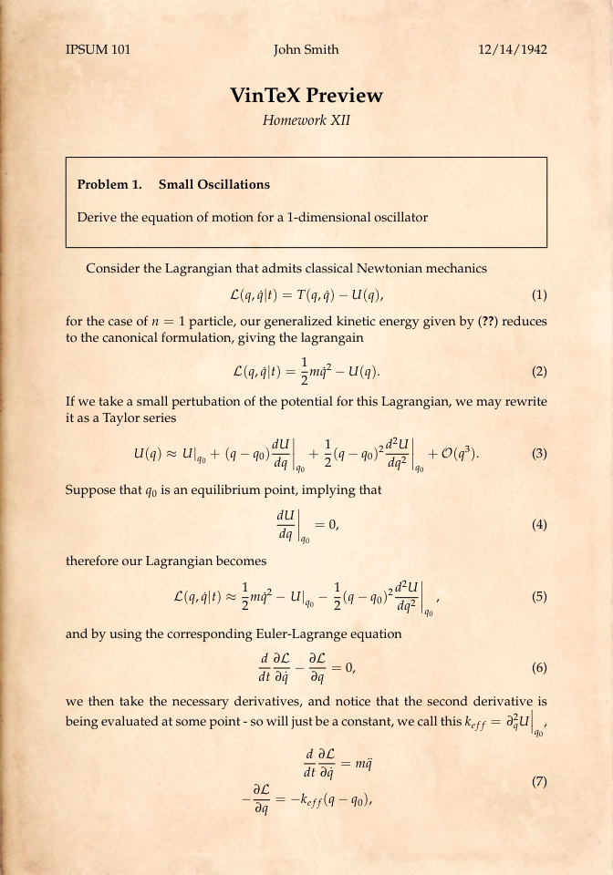
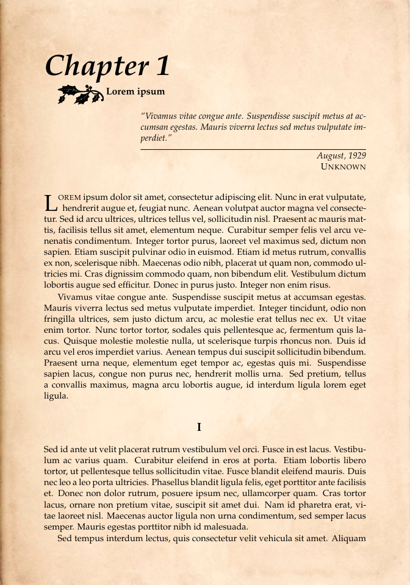
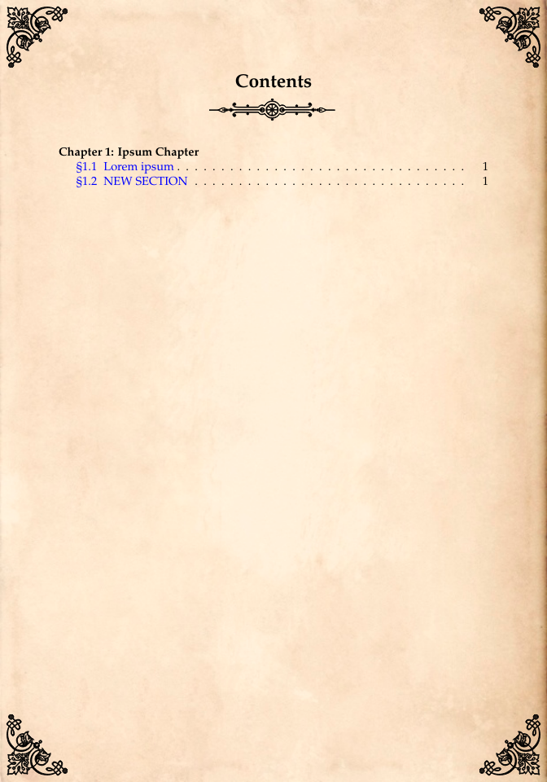
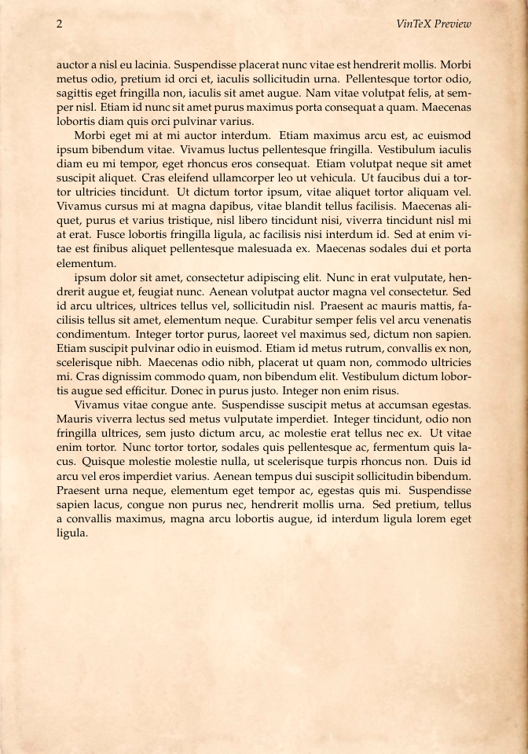
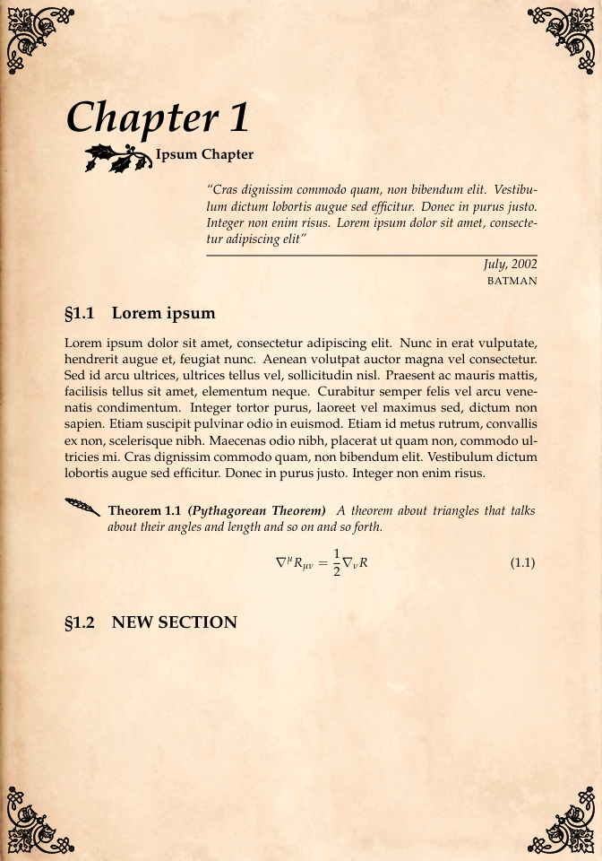

# vinTeX

Collection of [LaTeX](https://www.latex-project.org/) templates with a vintage aesthetic. Currently there are three available templates: **homework**, **notes**, and **novel**.

## 🪄 Installation

### Prerequisites

- A TeX compiler ([LuaLaTeX](https://www.luatex.org/), [pdfLaTeX](https://ctan.org/pkg/pdftex), [XeLaTeX](https://ctan.org/pkg/xetex)) with access to [CTAN](https://ctan.org/) packages.
  
| Homework | Novel | Notes |
|:-----------------|:------------------|:-----------------------|
|  |  |  |
|  |  |  |
|  |  |  |


### 🐾 Step-by-Step Instructions

1. **Clone this repository to your local machine**

```
git clone https://github.com/djstillme/vinTeX.git
```

## 📦 Usage

### Editing TeX Files

Inside the `src` folder, you'll find three templates, each with a .tex file tailored to a specific media type. This is the file you should edit for your project. To modify the template structure itself, refer to the `utils` folder.

> [!IMPORTANT]
> The exception is the `notes` template, which handles the notation page a bit differently. To modify it, you'll need to edit `notes/utils/notation.tex` in two places:
> 1. **Commands** – Define shorthand commands you can use throughout your document, while not explicitly needed, it's useful for keeping notation consistent throughout your paper.
> 2. **Glossary Elements** – Add entries that will appear on the notation page.
>    
> The template includes plenty of examples in both sections to help guide you.


### Compiling the Project

Simply use your **TeX** compiler of choice to run the .tex file located in any one of the three template folders.

## Image Gallery

<details> 
  <summary>Homework preview</summary>

 | Preview | 
  | ------------- | 
  |   | 
</details>

<details> 
  <summary>Novel preview</summary>

 | Preview | 
  | ------------- | 
  |   | 
</details>

<details> 
  <summary>Notes preview</summary>

 | Preview | 
  | ------------- | 
  |   | 
</details>
