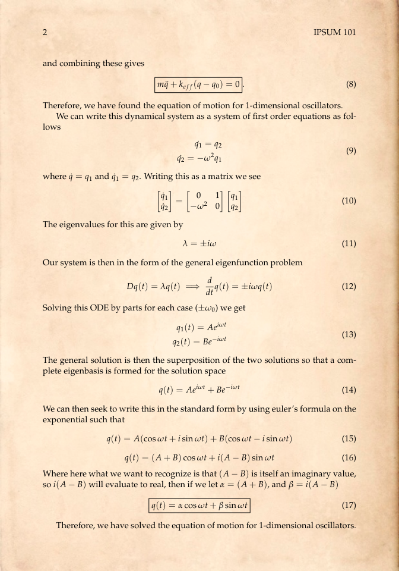

# vinTeX

Collection of LaTeX templates with a vintage aesthetic. Currently there are three available templates: `homework`, `novel`, and `notes`. Usage should be as straightforward as compiling the `.tex` file located in each `/src` directory, given that you have an up-to-date TeX compiler that has access to the [CTAN](https://ctan.org/) packages.

## Image Gallery

 
  
Homework preview

 | Preview | 
  | ------------- | 
  |   | 

 
  
Novel preview

 | Preview | 
  | ------------- | 
  |   | 

 
  
Notes preview

 | Preview | 
  | ------------- | 
  |   | 

